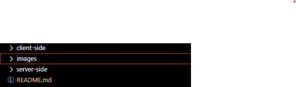
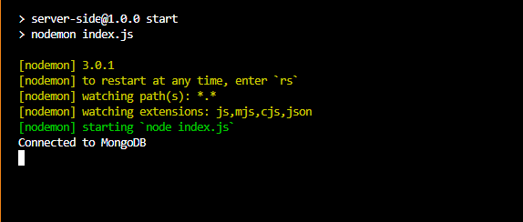
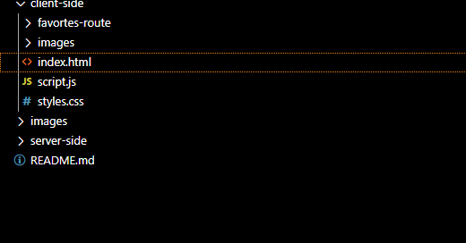

## OBJECTIVE OF PROJECT

This is a complete simple movie site that pulls data from an api and returns it to the user. The user is then given the chance to store some of the movies as their favorites and they can always find the movies stored in their favorites route no matter which device they access the site from because their favorite movies are posted and stored in a database collection.

## FRONTEND COMPONENTS

The front end is built entirely using only html, css and javascript. This is so because the task description requires that the site be built with these technologies.

## API AND SERVER

The server is built with Node.js and Express.js which defines all required methods and requests to ensure that the site is powered efficiently.
All the methods and actions required to be carried out by the site are defined comprehensively within the server and the different server end points are used by the front end.
The server also is responsible for communicating with the database as well as the external movie API [TMDB](https://developer.themoviedb.org/reference/intro/getting-started).

## DATABASE

The storage architecture is built with [mongodb atlas](https://www.mongodb.com/atlas) and [mongoose](https://mongoosejs.com/) is used to communicate with the database.
Mongodb atlas is used as it is easy to achieve the objectives of the task as well as utilizing the advantage that it is cloud based and has aws running in the background. The ease to establish a connection to the database is also a perk that comes with using mongodb atlas and mongoose which is an advantage for this use case with the task to en sure that the site runs effectively on any machine that follows the instructions to start it as described below:

## RUN THE PROJECT ON YOUR MACHINE

#### 1. clone the repo.

Before the project can be run, it has to be pulled to your local machine using the command below which can be pasted in your command line terminal or your integrated terminal in vs code.

```
git clone https://github.com/IsaacHarrison28/Gyzer-Technologies-application-task.git
```

Ensure that you have [node](https://nodejs.org/en/) installed on your machine as well as [git](https://git-scm.com/) to ensure that you do not meet any errors during this process of cloning the repo.

#### 2. open the project folder

After the clone is successful, you can now navigate to the folder and open the whole folder in your IDE. The author recommends [vs code](https://code.visualstudio.com/) to which you will see the folder structure as shown below.



#### 3. open the terminal

If the project is opened in vs code as recommended by the author, use the short hand command below to open the terminal within vs code:

```
Ctrl + Shift + `
```

#### 4. start the server

In the terminal, navigate to the folder 'server-side' using the by pasting this command in the terminal:

```
cd server-side
```

when you have navigated in the 'server-side' directory, run the following command to install all depencies for the server:

```
npm install
```

After all depencies are installed, start the server by using this command:

```
npm start
```

which will start the server and allow mongoose to connect to the database to which this will be confirmed with a message as shown below:



#### 5. Open the front end

To launvh the front end portion of the project, navigate to the 'client-side' directory while you leave the server running. You can use the file explorer containing the folder structure as shown previously and open the 'index.html' that is in 'client-side'



#### 6. Congratulations

You can now use the site and test everything freely.
